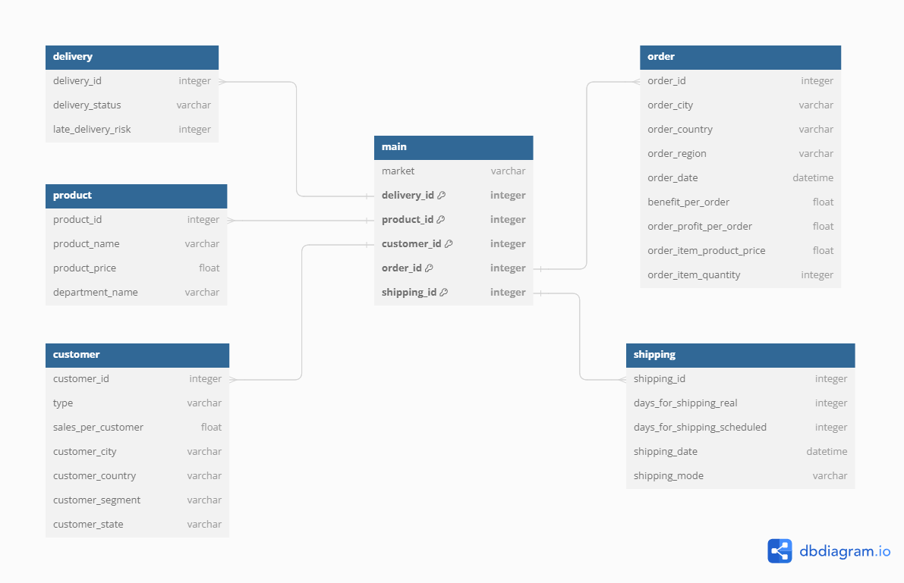
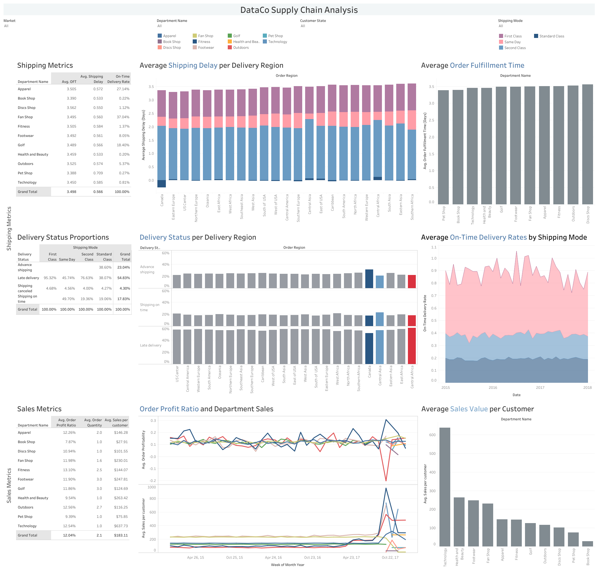
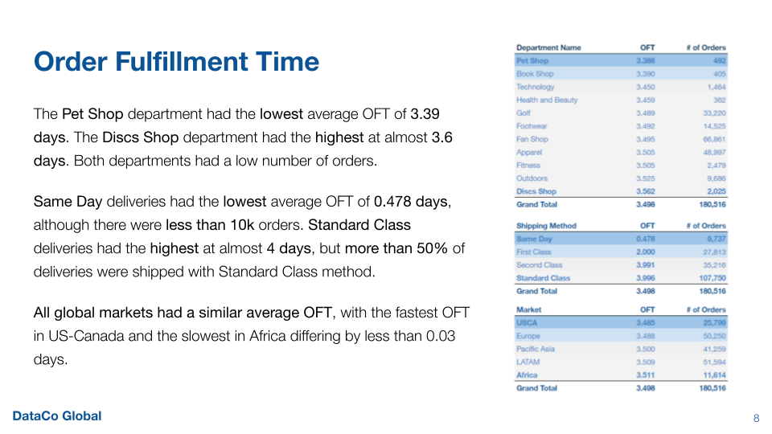
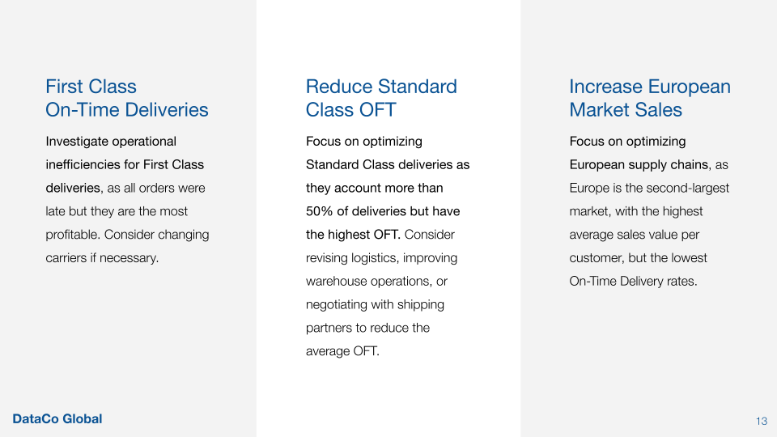
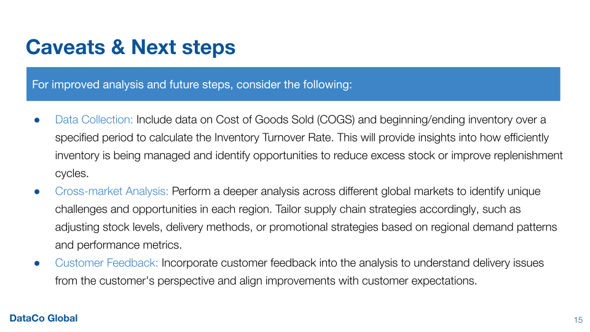

# DataCo Supply Chain Analytics

- **Goal and Dataset Structure**
- **Insights Summary**
- **Recommendations**
- **Performance Dashboard**
- **Presentation**
 
## Goal:
*DataCo Global is a fictitious company.*
The goal of this project is to investigate the operational efficiency of supply chains used by DataCo Global to surface recommendations on delivery delay reductions.

## Dataset Structure:
The dataset consisted of one table including information about customers, store locations, shipping locations, delivery status, among other variables. The key features and the table schema are shown below:

## Insights Summary:
**In order to evaluate the operational efficiency and analyze sales, we focused on the following key metrics:**
- **Order Fulfillment Time:** Order Shipping Date - Order Placement Date. This helps measure how fast a supply chain can handle shipping.
- **On-Time Delivery Rate:** The percent of deliveries that arrive on-time to their destination.
- **Order Item Profit Ratio:** The profit made from an order divided by the product price of the order before any discounts. This helps assess how profitable an item is relative to its price.
- **Sales Value per Customer:** The average sales value of the purchases made by a customer.

**Order Fulfillment Rate**
- The **Pet Shop department** had the **lowest** average OFT of **3.39 days**. The Discs Shop department had the highest at almost 3.6 days. Both departments had a low number of orders.
- **Same Day** deliveries had the **lowest** average OFT of **0.478 days**, although there were less than 10k orders. Standard Class deliveries had the highest at almost 4 days, but more than 50% of deliveries were shipped with Standard Class.
- **All global markets had a similar average OFT**, with the fastest OFT in US-Canada and the slowest in Africa differing by less than 0.03 days.

**On-Time Delivery Rate**
- The **Discs Shop department** had the **highest** On-Time Delivery rate of **41.43% days**, while only having 839 orders. The Pet Shop department had the lowest at 37%, with only 182 orders.
- **Standard Class** deliveries had the **highest** On-Time Delivery rate of **57.66%**, with over 62k orders arriving on-time. First Class deliveries had the lowest, with no orders arriving on-time.
- **All global markets had a similar average On-Time Delivery Rate**, with the highest in Africa and the lowest in Europe differing only by around 1%.

**Order Item Profit Ratio**
- The **Fitness department** had the **highest** profit ratio of **13.12%**. The Book Shop department was the least profitable at 7.91%.
- **First Class** deliveries had the **highest** order item profit ratio of **12.65%**, with over 27k orders. Same Day deliveries had the lowest, with a profit ratio of 11.76% per order item.
- The **African market** is the **most profitable**, with an order item profit ratio around 1% higher than Pacific Asia (11.59%), and at least 0.25% more profitable than the rest of the markets.

**Sales Value per Customer**
- The **Technology department** had the **highest** sales value per customer at **$637.73**, more than **double** of any other department. The Book Shop department had the lowest at $27.91, almost a third of the second lowest, the Pet Shop department.
- **Standard Class** deliveries had the **highest** sales value per customer of **$183.68**. Same Day deliveries had the lowest, with $179.23.
- The **European market** had the **highest** sales value per customer ($194.40), more than $14 higher than Pacific Asia ($180.18). The market with the lowest sales per customer was US-Canada ($176.50), almost $20 per customer less than the European market.

## Main Recommendations:
- Focus on optimizing Standard Class deliveries as they account more than 50% of deliveries but have the highest OFT. Consider revising logistics, improving warehouse operations, or negotiating with shipping partners to reduce the average OFT.
- Prioritize European supply chains, as Europe is the second-largest market, with the highest average sales value per customer, but the lowest On-Time Delivery rates.
- Investigate operational inefficiencies for First Class deliveries, as all orders were late but they are the most profitable. Consider changing carriers if necessary. 

## Performance Dashboard:
The Tableau Public Dashboard can be viewed [here](https://public.tableau.com/views/dataco_supply_chain_analysis/DataCoDashboard?:language=en-US&:sid=&:redirect=auth&:display_count=n&:origin=viz_share_link).

## Presentation Samples:
The presentation created for a Logistics and Operations team walks through the insights and recommendations above and can be found [here](https://docs.google.com/presentation/d/1YRsjol2CDJYCgXTLvIrZK1GCY26MXXMTdnmRFiCXFrc/edit?usp=sharing). Some extracts are presented below for easy viewing.

## Data Source:
Constante, Fabian; Silva, Fernando; Pereira, António (2019), “DataCo SMART SUPPLY CHAIN FOR BIG DATA ANALYSIS”, Mendeley Data, V5, doi: 10.17632/8gx2fvg2k6.5
